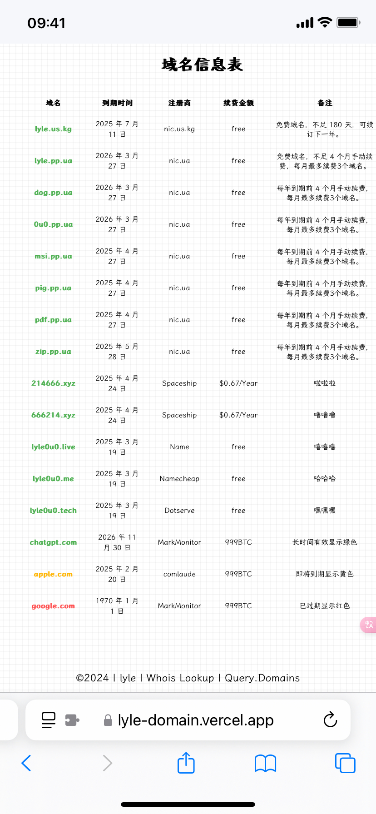
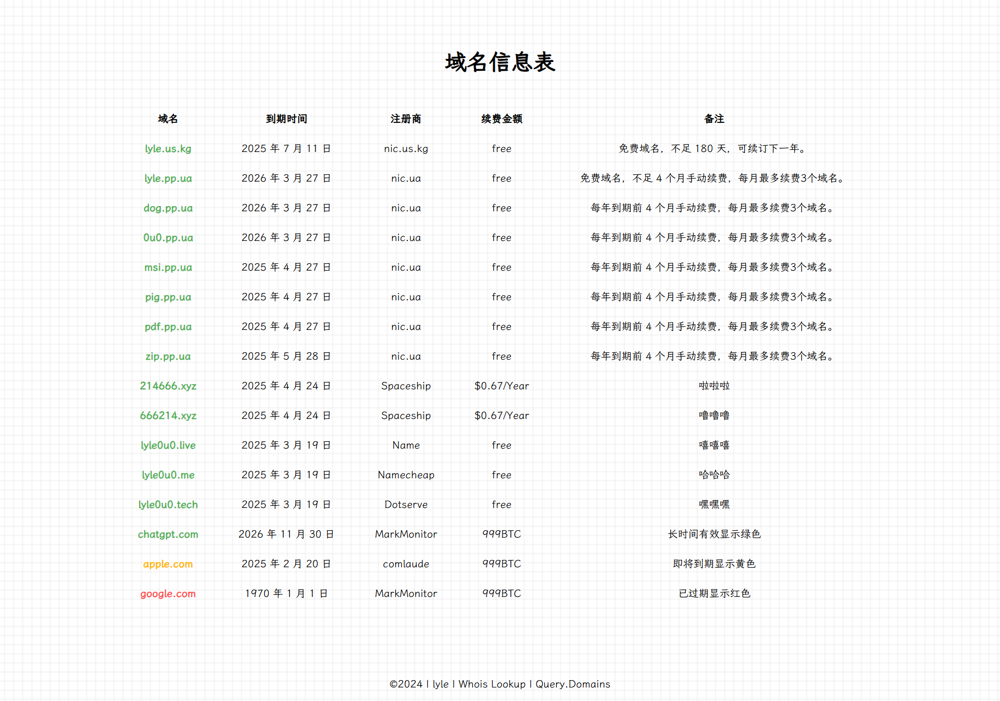

为了方便管理域名的续费时间，特别是像 `pp.ua` 和 `us.kg` 这样的免费域名，有时续费日期容易忘记，导致域名过期或需要紧急续费。因此，写了一个简单的静态域名表格来记录这些信息。

### 功能介绍
- **域名**和**注册商**都以超链接的形式展示。
- 域名的状态通过颜色标识：
  - **绿色**：域名有效期较长
  - **黄色**：剩余时间少于90天
  - **红色**：域名已经过期

所有域名信息都存储在一个**JSON文档**里。

```json
{
    "registrarLinks": {
        "nic.ua": "https://nic.ua/",
        "nic.us.kg": "https://nic.us.kg/",
        "Spaceship": "https://www.spaceship.com/",
        "GoDaddy": "https://www.godaddy.com",
        "Namecheap": "https://www.namecheap.com",
        "Name": "https://www.name.com/",
        "Dotserve": "http://dotserve.website",
        "MarkMonitor":"http://www.markmonitor.com",
        "comlaude":"https://comlaude.com/"
    }, 
    "domains": [
	 {
        "domain": "google.com",
        "expiryDate": "1970年1月1日",
        "registrar": "MarkMonitor",
        "renewalFee": "999BTC",
        "salePrice": "999BTC",
        "remarks": "已过期显示红色"
    }
]
}
```

由于这是我个人使用，**出售金额**部分被注释掉了。如果需要展示出售金额，可以按照以下步骤操作：
- 在HTML文件第26行取消注释
- 在JS文件第115行和123行取消注释

这样就能显示出售金额了。

### [示例demo](https://lyle-domain.vercel.app/)
### 移动端

### Web端

